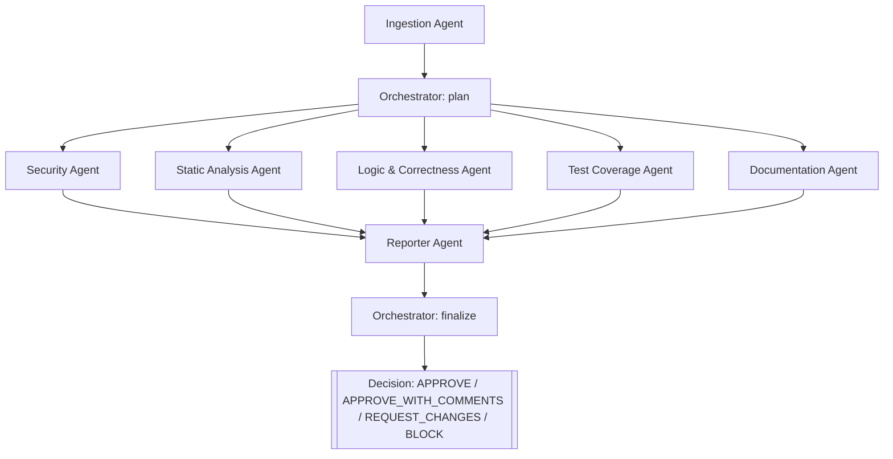

# CodeGuard Architecture

## Graph



## Pattern: supervisor + parallel workers + aggregator

- **Ingestion Agent** parses the raw PR bundle (title, description,
  per-file diffs) and classifies each file as `source`, `test`, `docs`,
  or `config`. Every downstream agent consumes this normalized shape
  instead of re-parsing diffs.
- **Orchestrator Agent** runs twice: `plan()` decides (and records the
  reasoning for) which specialists matter given the file mix, and
  `finalize()` turns the reporter's decision into a merge policy
  statement. It never inspects code itself — it only routes and applies
  policy.
- **Five specialist agents run in parallel** against the same PR state:
  Security, Static Analysis, Logic & Correctness, Test Coverage, and
  Documentation. Each has a narrow, non-overlapping system prompt (see
  `.claude/AGENT_PROMPTS.md`) and emits `Finding` objects via a shared
  `flag_finding` tool schema. Running them in parallel (via a thread pool
  in `src/core/graph.py`) is safe because they only read shared PR state
  and each writes to its own state key (`security_findings`,
  `style_findings`, etc.) — no shared mutation, no race condition.
- **Reporter Agent** merges all five findings lists, sorts by severity,
  and renders the final Markdown report plus a machine-readable decision
  (`APPROVE` / `APPROVE_WITH_COMMENTS` / `REQUEST_CHANGES` / `BLOCK`).
- **Orchestrator.finalize** converts that decision into an actionable
  merge policy sentence (e.g. "requires human security sign-off").

## Why this pattern

A single monolithic reviewer prompt has to hold security judgment, style
convention, correctness reasoning, test-coverage awareness, and
documentation standards simultaneously — which in practice means it
under-weights whichever concern is asked about least. Splitting into
narrow specialist agents with **disjoint responsibilities** (each system
prompt explicitly says what *not* to flag) makes each agent's output more
reliable and makes it possible to run them in parallel for latency, and to
add/remove/swap one specialist without touching the others.

## State shape

The graph operates on a single shared `dict` that accumulates keys as it
flows through nodes:

```
pr_bundle_path          -> input
pr                       <- ingestion_agent
orchestrator_plan        <- orchestrator_agent.plan
security_findings        <- security_agent
style_findings           <- static_analysis_agent
logic_findings           <- logic_agent
test_findings            <- test_coverage_agent
docs_findings            <- documentation_agent
all_findings             <- reporter_agent
decision                 <- reporter_agent
report_markdown          <- reporter_agent
merge_policy             <- orchestrator_agent.finalize
```

## Live vs. mock execution

Every specialist agent's `run()` function calls a shared helper,
`run_specialist()` (`src/core/agent_helpers.py`), which branches on
`CODEGUARD_MODE`:

- **`live`** (default off): builds a diff-focused prompt, calls the
  Anthropic Messages API with the agent's system prompt and the shared
  `flag_finding` / `read_file` / `search_code` tool schemas
  (`src/tools/tool_schemas.py`), and converts `tool_use` blocks into
  `Finding` objects.
- **`mock`** (default): runs a deterministic, regex-based analyzer that
  implements the same rules the system prompt asks the model to apply.
  This makes the full 8-agent pipeline reproducibly testable
  (`tests/test_acceptance.py`) with zero API cost or network dependency,
  which matters for grading and CI.

## Framework choice

**Recommended for production: LangGraph.** Its `StateGraph` abstraction
(typed shared state, conditional edges, native parallel fan-out/fan-in,
built-in checkpointing/streaming) is a direct match for this
supervisor/worker/aggregator shape.

**Implemented for this capstone: a ~90-line custom state-graph engine**
(`src/core/graph.py`) that mirrors LangGraph's node/edge model
(`add_node`, sequential `add_step`, parallel `add_parallel`, shared dict
state) using only the Python standard library. This was a deliberate
tradeoff for a graded, potentially offline-run deliverable: zero install
risk, no version-pinning surface, and the exact same architecture. Porting
to native LangGraph is mechanical — each `add_node(name, fn)` call becomes
a LangGraph node, `add_parallel([...])` becomes fan-out edges into a join
node, and `graph.run(state)` becomes `graph.compile().invoke(state)`.
